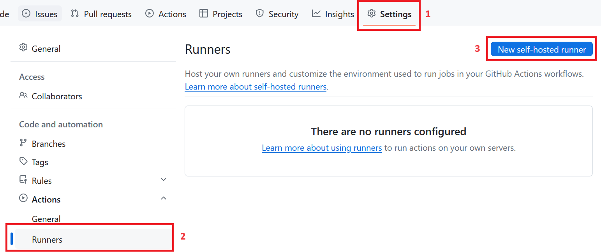
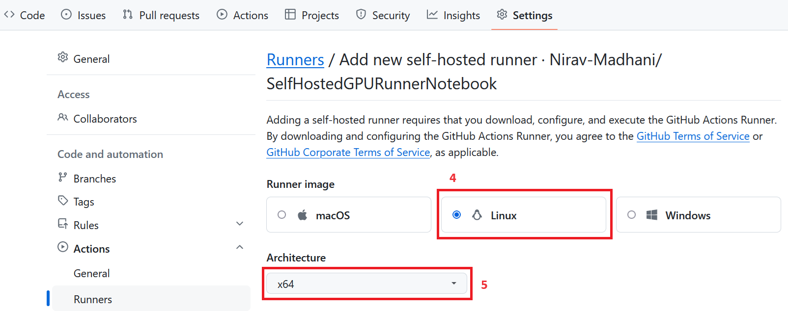
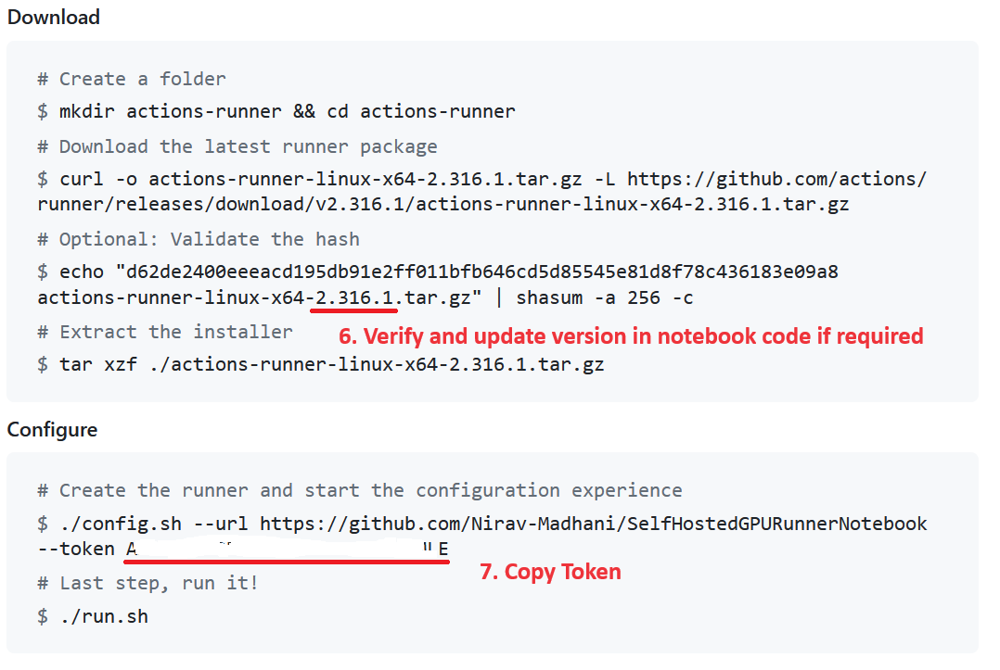

# Self-hosted GitHub actions GPU runners using cloud Jupyter notebooks

## About

This project enables the use of free cloud-based Jupyter notebooks as runners for GitHub Actions, addressing the common challenge of setting up CI/CD pipelines for machine learning projects. Cloud based GPU runners for CI/CD are often costly and computers with GPU are expensive, which can be a barrier for many developers.

By integrating these cloud-based Jupyter notebook environments with GitHub Actions, this repository allows you to run workflows with GPU acceleration without additional costs. This ensures that your machine learning projects can maintain continuous integration and deployment, leveraging the power of free GPU resources.

Key Features:
- **Enables Free GPU Access**: Utilize free cloud-based Jupyter notebooks for your CI/CD pipelines.
- **Easy Integration**: Connect your GitHub repository with cloud-based Jupyer Notebooks easily.
- **Student-Friendly**: Avoid the expenses associated with cloud GPU VMs or local GPU machines. 

This project aims to streamline the development process for machine learning practitioners, providing an accessible and efficient solution for CI/CD workflows. Future updates will include support for additional platforms, and a full fledge sample workflow.

## Supported Notebooks
- [x] Colab
- [ ] Kaggle (Colab Notebook can be used with slight modifications)

## Setting Up Runner on Github
1. Open your repo on Github, copy and paste its url into  `<github repo url>` placeholder and Click Settings
2. Click `Runners` in `Actions`
3. Click `New Self Hosted Runner`

4. Set `Runner Image` to `Linux` and
5.  `Architecture` to `x64`

6. Verify that runner version in Notebook matches with latest from GitHub. Update notebook to match version if required.

7. Copy the token as shown in Image and Paste it in notebook in `<token copied in step 7>` placeholder
8. Finally configure tensorboard path. It will be somewhere within `_work` directory inside runner depending on your code.
## How to Run Notebook

If you are running notebook first time after setting up runner:-

* Run all cells sequentially except for `Next Time Block`

else:-

* Run all cells sequentially except `First Time` Block

## Intended Audience
This repository is primarily intended for students and learners with limited access to GPUs, providing GPU resources for educational and learning purposes.

## Complying with Terms of Service

### Colab
To ensure compliance with Google Colab's terms of service while using it for CI/CD workflows, follow these guidelines:

- **Usage Limits**: Do not use Colab for long-running processes or heavy workloads. Colab is intended for interactive use, and extended sessions can violate usage policies.
- **Resource Management**: Be mindful of resource consumption. Avoid excessive GPU usage or running multiple sessions simultaneously.
- **Code of Conduct**: Follow the community guidelines and Google's code of conduct for appropriate use of Colab services.
- **General Note**: Always check the latest terms of service and usage policies for Colab to stay compliant and use these resources appropriately. Updates to the terms of service can be found on their respective pages: [Google Colab FAQ](https://research.google.com/colaboratory/faq.html).

By adhering to these guidelines, you can effectively use cloud-based Jupyter notebooks for CI/CD without violating terms of service.
